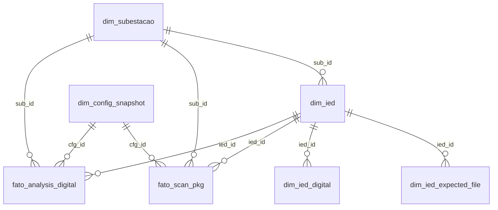

# comtrade_val — Validação e Análise de Oscilografias COMTRADE

Sistema automatizado para **ingestão, validação de integridade e análise de sinais digitais** de arquivos COMTRADE (IEEE C37.111) oriundos de IEDs (Intelligent Electronic Devices) instalados em subestações de energia elétrica.

Os resultados são persistidos em PostgreSQL e podem ser consumidos por dashboards Grafana para monitoramento contínuo de oscilografias e detecção de eventos (e.g., falhas de comutação).

---

## Sumário

- [Visão Geral](#visão-geral)
- [Arquitetura e Fluxo de Dados](#arquitetura-e-fluxo-de-dados)
- [Estrutura do Projeto](#estrutura-do-projeto)
- [Pré-requisitos](#pré-requisitos)
- [Configuração](#configuração)
  - [Banco de Dados](#banco-de-dados)
  - [Arquivo de Configuração JSON](#arquivo-de-configuração-json)
- [Uso](#uso)
  - [1. Criar o Schema no PostgreSQL](#1-criar-o-schema-no-postgresql)
  - [2. Popular o Catálogo (config → banco)](#2-popular-o-catálogo-config--banco)
  - [3. Executar o Pipeline Principal](#3-executar-o-pipeline-principal)
  - [4. Visualizar no Grafana](#4-visualizar-no-grafana)
- [Schema do Banco de Dados](#schema-do-banco-de-dados)
  - [Tabelas de Catálogo (dim_*)](#tabelas-de-catálogo-dim_)
  - [Tabelas de Fatos (fato_*)](#tabelas-de-fatos-fato_)
  - [Views](#views)
  - [Diagrama ER](#diagrama-er)
- [Pipeline — Detalhamento Técnico](#pipeline--detalhamento-técnico)
  - [Fase 1: Scan de Integridade](#fase-1-scan-de-integridade)
  - [Fase 2: Análise de Sinais Digitais](#fase-2-análise-de-sinais-digitais)
  - [Reprocessamento Inteligente](#reprocessamento-inteligente)
- [Scripts Auxiliares](#scripts-auxiliares)
- [Formato COMTRADE](#formato-comtrade)
- [Dependências Python](#dependências-python)

---

## Visão Geral

O sistema opera em duas fases principais:

1. **Scan de integridade**: Percorre diretórios de oscilografias, agrupa arquivos por stem (nome-base), verifica se todas as extensões esperadas (`.cfg`, `.dat`, `.hdr`) estão presentes e sem tamanho zero.
2. **Análise de canais digitais**: Para oscilografias íntegras, carrega os dados COMTRADE e detecta bordas de subida (transições 0→1) em canais digitais previamente mapeados — tipicamente sinais de trigger, falha de comutação e proteção.

---

## Arquitetura e Fluxo de Dados

```
                     config_with_locations.json
                              │
                    config_json_to_db.py
                              │
                              ▼
                  ┌───────────────────────┐
                  │  PostgreSQL (osci.*)   │
                  │  Tabelas de catálogo   │
                  │  dim_subestacao        │
                  │  dim_ied              │
                  │  dim_ied_digital      │
                  │  dim_config_snapshot   │
                  └───────────┬───────────┘
                              │
                     main_pgsql.py
                     (lê config do banco)
                              │
              ┌───────────────┴───────────────┐
              │                               │
      Fase 1: Scan                   Fase 2: Análise
   (lista arquivos,               (carrega COMTRADE,
    verifica integridade)          detecta rising edges)
              │                               │
              ▼                               ▼
      fato_scan_pkg                fato_analysis_digital
              │                               │
              └───────────┬───────────────────┘
                          │
                    Grafana / SQL
                   (dashboards, alertas)
```

---

## Estrutura do Projeto

```
comtrade_val/
│
├── main_pgsql.py              # Pipeline principal (PostgreSQL)
├── main.py                    # Pipeline legado (MySQL) — descontinuado
├── config_json_to_db.py       # Carrega config JSON → tabelas de catálogo
├── teste_canais.py            # Utilitário para inspecionar canais COMTRADE
│
├── config.json                # Configuração básica (subestações + IEDs)
├── config_with_locations.json # Config estendida com coordenadas geográficas
│
├── db_queries/
│   ├── criacao_db_v0.sql                # DDL completa do schema osci
│   ├── script_ini.sql                   # Placeholder para inicialização
│   ├── view_ieds_por_subestacao.sql     # View: IEDs agrupados por subestação
│   └── view_teste_dados_p_grafana.sql   # View analítica para Grafana
│
├── adicao_nova_SE_IED.sql     # Template SQL para incluir nova subestação/IED
├── schema_erd.mmd             # Diagrama ER (Mermaid) gerado automaticamente
│
├── aux_db/
│   ├── db_drawer.py           # Gera diagrama ER a partir do schema PostgreSQL
│   └── desenho.pgerd          # Arquivo pgAdmin ERD
│
├── WaveForms_0/               # Oscilografias (.cfg, .dat, .hdr) — SE_PAXNGX
├── WaveForms_1/               # Oscilografias — SE_RJTRIO
│
├── scan_SE_*.csv              # Saída CSV do scan (backup/conferência)
└── analysis_SE_*.csv          # Saída CSV da análise (backup/conferência)
```

---

## Pré-requisitos

| Componente         | Versão mínima |
| ------------------ | ------------- |
| Python             | 3.9+          |
| PostgreSQL         | 12+           |
| (Opcional) Grafana | 9+            |

### Dependências Python

```
pandas
numpy
comtrade
sqlalchemy
psycopg2          # ou psycopg2-binary
```

Instalação:

```bash
pip install pandas numpy comtrade sqlalchemy psycopg2-binary
```

---

## Configuração

### Banco de Dados

Edite as constantes de conexão nos arquivos `main_pgsql.py` e `config_json_to_db.py`:

```python
DB_HOST = "localhost"
DB_PORT = 5432
DB_NAME = "oscilografias_v0"
DB_USER = "postgres"
DB_PASS = "admin"
```

### Arquivo de Configuração JSON

O arquivo `config_with_locations.json` define subestações, IEDs, extensões esperadas e canais digitais monitorados:

```json
{
  "substations": [
    {
      "id": "SE_RJTRIO",
      "base_dir": "C:/caminho/para/WaveForms_1",
      "location": {
        "name": "SE Terminal Rio (Paracambi, RJ)",
        "lat": -22.656111,
        "lon": -43.768611,
        "datum": "WGS84"
      },
      "ieds": [
        {
          "id": "RJTRIO_PL1_UPD1",
          "expected_files": [".cfg", ".dat", ".hdr"],
          "channels": {
            "digitals": [
              { "index": 1, "id_hint": "VO1", "description": "TRIGGER_OSC" },
              { "index": 2, "id_hint": "CI2", "description": "MCB TP ABERTO" },
              { "index": 3, "id_hint": "CI3", "description": "FLH COMUT PCP" }
            ]
          }
        }
      ]
    }
  ]
}
```

| Campo | Descrição |
| ----- | --------- |
| `id` | Identificador único da subestação |
| `base_dir` | Diretório-raiz onde estão as oscilografias do IED |
| `location` | Coordenadas geográficas (WGS84) e nome descritivo |
| `ieds[].id` | Prefixo do IED no nome dos arquivos COMTRADE |
| `ieds[].expected_files` | Extensões obrigatórias para considerar a oscilografia íntegra |
| `ieds[].channels.digitals` | Lista de canais digitais a monitorar, com índice 1-based, hint e descrição |

---

## Uso

### 1. Criar o Schema no PostgreSQL

```bash
psql -U postgres -d oscilografias_v0 -f db_queries/criacao_db_v0.sql
```

Isso cria o schema `osci` com todas as tabelas e índices necessários.

### 2. Popular o Catálogo (config → banco)

```bash
python config_json_to_db.py
```

Lê `config_with_locations.json` e faz upsert nas tabelas de catálogo (`dim_subestacao`, `dim_ied`, `dim_ied_expected_file`, `dim_ied_digital`). O comportamento é **não destrutivo** — campos existentes só são sobrescritos se estiverem vazios.

Opcionalmente cria um snapshot versionado do JSON em `dim_config_snapshot`.

### 3. Executar o Pipeline Principal

```bash
python main_pgsql.py
```

O pipeline:

1. Carrega a configuração de subestações/IEDs diretamente do banco de dados.
2. **Fase 1 (Scan)**: Varre os diretórios, verifica integridade dos arquivos e grava em `fato_scan_pkg`.
3. **Fase 2 (Análise)**: Para cada oscilografia íntegra ainda não processada, carrega os dados COMTRADE, detecta bordas de subida nos canais digitais mapeados e grava em `fato_analysis_digital`.
4. Pula oscilografias já processadas (reprocessamento inteligente).

Para gerar CSVs de conferência além da gravação no banco, altere a flag:

```python
WRITE_CSV = True
```

### 4. Visualizar no Grafana

Conecte o Grafana ao PostgreSQL e utilize as views já disponíveis:

- `osci.v_osci_subestacao_dim` — Lista subestações com seus IEDs agregados
- Query analítica em `db_queries/view_teste_dados_p_grafana.sql` — Métricas por subestação: total de oscilografias, taxa de erro, contagem de falhas de comutação

---

## Schema do Banco de Dados

### Tabelas de Catálogo (dim_*)

| Tabela | Chave Primária | Descrição |
| ------ | -------------- | --------- |
| `dim_subestacao` | `sub_id` | Cadastro de subestações (nome, base_dir, município, UF, coordenadas) |
| `dim_ied` | `ied_id` | IEDs vinculados a uma subestação (FK → `dim_subestacao`) |
| `dim_ied_expected_file` | `(ied_id, ext)` | Extensões esperadas por IED (`.cfg`, `.dat`, `.hdr`) |
| `dim_ied_digital` | `(ied_id, idx1)` | Canais digitais monitorados (índice 1-based, hint, descrição) |
| `dim_config_snapshot` | `cfg_id` | Snapshots versionados do JSON de configuração |

### Tabelas de Fatos (fato_*)

| Tabela | Chave Primária | Descrição |
| ------ | -------------- | --------- |
| `fato_scan_pkg` | `(sub_id, ied_id, stem)` | Resultado do scan de integridade por oscilografia |
| `fato_analysis_digital` | `(sub_id, ied_id, stem, channel_index)` | Resultado da análise de canais digitais |

#### Colunas principais — `fato_scan_pkg`

| Coluna | Tipo | Descrição |
| ------ | ---- | --------- |
| `expected` | JSONB | Extensões esperadas (e.g., `[".cfg", ".dat", ".hdr"]`) |
| `present` | JSONB | Extensões encontradas no diretório |
| `missing` | JSONB | Extensões faltantes |
| `zero_kb` | JSONB | Extensões com arquivo de 0 bytes |
| `size_cfg`, `size_dat`, `size_hdr`, `size_inf` | BIGINT | Tamanho em bytes de cada arquivo |
| `max_arrival_skew_s` | DOUBLE | Diferença máxima entre mtimes dos arquivos (indica transferência parcial) |
| `integrity_ok` | BOOLEAN | `TRUE` se todos os arquivos esperados estão presentes e sem tamanho zero |

#### Colunas principais — `fato_analysis_digital`

| Coluna | Tipo | Descrição |
| ------ | ---- | --------- |
| `channel_index` | INT | Índice 1-based do canal digital no COMTRADE |
| `channel_name` | TEXT | Nome do canal extraído do arquivo `.cfg` |
| `triggered` | BOOLEAN | `TRUE` se houve pelo menos uma borda de subida (0→1) |
| `first_rise_dt` | TIMESTAMPTZ | Timestamp absoluto da primeira borda de subida |
| `n_rises` | INT | Número total de bordas de subida detectadas |

### Views

| View | Descrição |
| ---- | --------- |
| `v_osci_subestacao_dim` | Subestações com lista agregada de IEDs (para tooltips Grafana) |

### Diagrama ER

O diagrama é gerado automaticamente por `aux_db/db_drawer.py` e salvo em `schema_erd.mmd` (formato Mermaid):



---

## Pipeline — Detalhamento Técnico

### Fase 1: Scan de Integridade

A função `scan_substation()` realiza:

1. Lista todos os arquivos `.cfg`, `.dat`, `.hdr`, `.inf` no `base_dir` da subestação.
2. Filtra pelo `ied_id` (prefixo no nome do arquivo).
3. Agrupa por **stem** (nome-base sem extensão, e.g., `PAXNGX_PL1_UPD1-20250727-170640909-OSC`).
4. Para cada grupo, verifica:
   - Quais extensões esperadas estão **presentes**
   - Quais estão **faltando**
   - Quais têm **tamanho zero** (indicativo de transferência incompleta)
   - **Skew de chegada** (`max(mtime) - min(mtime)`) — valores altos indicam transferência parcial
5. Grava os resultados em `fato_scan_pkg` via upsert.

### Fase 2: Análise de Sinais Digitais

A função `analyze_integral_packages()` processa apenas oscilografias com `integrity_ok = TRUE`:

1. Carrega os arquivos `.cfg` e `.dat` usando a biblioteca `comtrade`.
2. Extrai o vetor temporal e todos os canais digitais (status).
3. Para cada canal digital mapeado no catálogo:
   - Converte o sinal para binário (0/1).
   - Detecta **bordas de subida** (transições 0→1).
   - Calcula o timestamp absoluto: extrai a data/hora do stem via regex (`-YYYYMMDD-HHMMSSmmm-OSC`) e soma o offset em segundos da borda.
4. Grava em `fato_analysis_digital`.

#### Extração de datetime do stem

O padrão regex `-(\d{8})-(\d{6,9})-OSC` extrai:

```
PAXNGX_PL1_UPD1-20250727-170640909-OSC
                 ^^^^^^^^ ^^^^^^^^^
                 YYYYMMDD HHMMSSmmm
```

Resultado: `2025-07-27T17:06:40.909 America/Sao_Paulo`

### Reprocessamento Inteligente

O pipeline evita reprocessar oscilografias já analisadas:

1. Verifica se já existem registros em `fato_analysis_digital` para `(sub_id, ied_id, stem)`.
2. Se sim, pula a oscilografia.
3. Antes de reprocessar, executa `DELETE` preventivo para evitar duplicatas.

---

## Scripts Auxiliares

### `teste_canais.py` — Inspeção de Canais COMTRADE

Utilitário para depuração: carrega um único arquivo COMTRADE e exporta CSVs com metadados dos canais.

**Saída:**
- `{stem}__analogs.csv` — Índice, ID, nome e unidade de cada canal analógico
- `{stem}__digitals.csv` — Índice, ID, nome e label de cada canal digital

Útil para validar se os índices configurados no JSON correspondem aos canais reais do IED.

### `aux_db/db_drawer.py` — Gerador de Diagrama ER

Conecta ao PostgreSQL, lê o schema e gera automaticamente:
- `schema_erd.mmd` — Diagrama Mermaid com tabelas, colunas, PKs, FKs e relacionamentos
- (Opcional) Exportação PNG via `mmdc` (Mermaid CLI)

### `config_json_to_db.py` — Carga de Configuração

Popula as tabelas de catálogo a partir do JSON:
- Extrai município e UF do campo `location.name` via regex (e.g., `"SE Nome (Cidade, UF)"`)
- Insere coordenadas geográficas (lat/lon WGS84)
- Cria snapshot versionado do JSON completo
- Upsert não destrutivo — só atualiza campos ainda vazios no banco

### `adicao_nova_SE_IED.sql`

Template SQL para inclusão manual de novas subestações e IEDs diretamente no banco, sem passar pelo JSON.

---

## Formato COMTRADE

Os arquivos seguem o padrão **IEEE C37.111 (COMTRADE)**:

| Extensão | Conteúdo |
| -------- | -------- |
| `.cfg` | Configuração textual — define canais (analógicos/digitais), taxa de amostragem, timestamps |
| `.dat` | Dados binários — amostras de cada canal |
| `.hdr` | Cabeçalho opcional com metadados adicionais |
| `.inf` | Informações complementares (opcional) |

A nomenclatura dos arquivos segue o padrão:

```
{IED_ID}-{YYYYMMDD}-{HHMMSSmmm}-OSC.{ext}
```

Exemplo: `PAXNGX_PL1_UPD1-20250727-170640909-OSC.cfg`

---

## Dependências Python

| Pacote | Uso |
| ------ | --- |
| `pandas` | DataFrames, manipulação de dados, exportação CSV |
| `numpy` | Arrays numéricos, detecção de bordas de subida |
| `comtrade` | Parse de arquivos COMTRADE (CFG + DAT) |
| `sqlalchemy` | Abstração de banco de dados, gerenciamento de conexão |
| `psycopg2` | Driver PostgreSQL |
| `zoneinfo` | Fuso horário `America/Sao_Paulo` (stdlib, Python 3.9+) |
| `pathlib` | Manipulação de caminhos de arquivo multiplataforma |
| `json` | Parse de configuração e serialização JSONB |
| `re` | Extração de datetime via regex dos nomes de arquivo |
